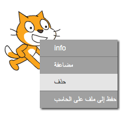

يمكنك استخدام Scratch عبر الإنترنت أو بدون اتصال.

+ لإنشاء مشروع Scratch جديد باستخدام المحرر عبر الإنترنت ، انتقل إلى<a href="http://jumpto.cc/scratch-new" target="_blank">jumpto.cc/scratch-new</a>.

+ إذا كنت تفضل العمل دون اتصال ولم تقم بتثبيت المحرر بعد ، يمكنك تنزيله من<a href="http://jumpto.cc/scratch-off" target="_blank">jumpto.cc/scratch-off</a>.
    
    يظهر محرر Scratch على النحو التالي:
    
    

+ القط الذي يمكنك هو جالب للحظ في Scratch. إذا كنت بحاجة إلى مشروع Scratch فارغ ، يمكنك حذف القطة بالنقر على الزر الأيمن ثم النقر على **delete**.
    
    