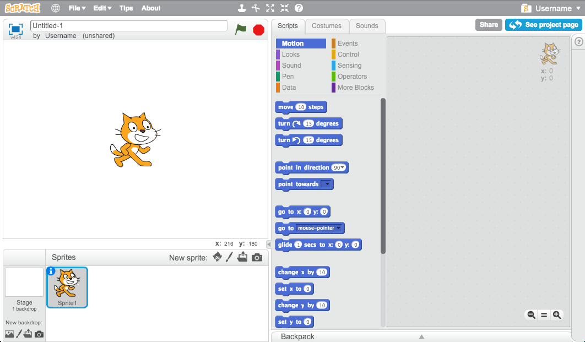

আপনি স্ক্র্যাচ অনলাইন বা অফলাইন ব্যবহার করতে পারেন।

+ অনলাইন সম্পাদক ব্যবহার করে একটি নতুন স্ক্র্যাচ প্রকল্প তৈরি করতে, <a href="http://jumpto.cc/scratch-new" target="_blank">jumpto.cc/scratch- new</a> তে যান।

+ যদি আপনি অফলাইন কাজ পছন্দ করেন এবং এখনো সম্পাদক ইনস্টল না করেন, আপনি এটি <a href="http://jumpto.cc/scratch-off" target="_blank">jumpto.cc/scratch-off</a> থেকে ডাউনলোড করতে পারেন।
    
    স্ক্র্যাচ সম্পাদক এইরকম দেখতে পায়:
    
    

+ আপনি যে বিড়াল পরী দেখতে পারেন তা হল স্ক্র্যাচ মাসকট। যদি আপনি একটি খালি স্ক্র্যাচ প্রকল্প প্রয়োজন, আপনি ডান ক্লিক করে বিড়াল মুছে ফেলতে পারেন এবং তারপর **মুছে** ক্লিক করে
    
    