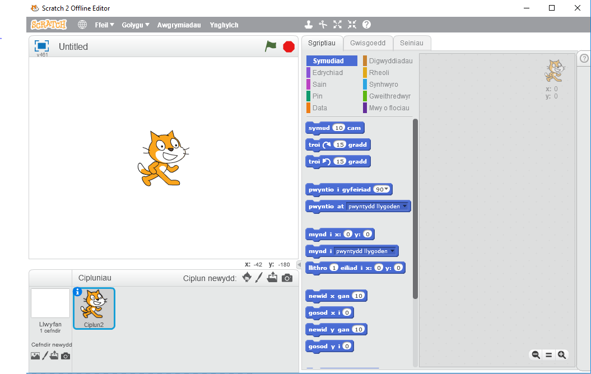
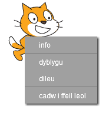

Gallwch ddefnyddio Scratch ar-lein neu all-lein.

+ I greu prosiect Scratch newydd gan ddefnyddio'r golygydd ar-lein, ewch i <a href="http://jumpto.cc/scratch-new" target="_blank">jumpto.cc/scratch-new</a>.

+ Os bydd yn well gen ti weithio all-lein a dwyt ti ddim wedi gosod y golygydd eto, gelli di ei lawrlwytho o <a href="http://jumpto.cc/scratch-off" target="_blank">jumpto.cc/scratch-off</a>.
    
    Mae golygydd Scratch yn edrych fel hyn:
    
    

+ Masgot Sratch ydy'r ciplun o gath y gelli di ei weld. Os oes angen prosiect Scratch gwag arnat ti, gelli di ddileu'r gath gan dde-glicio ac yna clicio ar **dileu**.
    
    