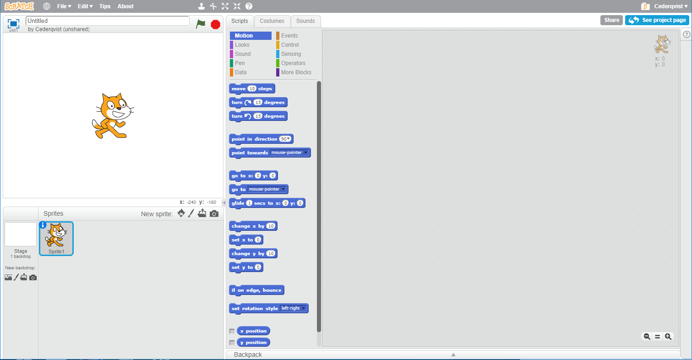
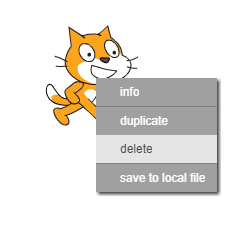

Du kan bruge Scratch både online eller offline.

+ For at oprette et nyt Scratch-projekt ved hjælp af online-editoren, skal du gå til <a href="http://jumpto.cc/scratch-new" target="_blank">jumpto.cc/scratch-new</a>.

+ Hvis du foretrækker at arbejde offline og ikke har installeret editoren endnu, kan du downloade den fra <a href="http://jumpto.cc/scratch-off" target="_blank">jumpto.cc/scratch-off</a>.
    
    Scratch-editoren ser sådan ud:
    
    

+ Katte-spriten, som du kan se, er Scratch-maskotten. Hvis du har brug for et tomt Scratch-projekt, kan du slette katten ved at højreklikke på den og derefter klikke **slet**.
    
    