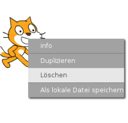

Du kannst Scratch online oder offline verwenden.

+ Um ein neues Scratch-Projekt mit dem Online-Editor zu erstellen, gehe zu <a href="http://jumpto.cc/scratch-new" target="_blank">jumpto.cc/scratch-new</a>.

+ Wenn du lieber offline arbeitest und den Editor noch nicht installiert hast, kannst du ihn von <a href="http://jumpto.cc/scratch-off" target="_blank">jumpto.cc/scratch-off</a> herunterladen.
    
    Der Scratch-Editor sieht folgendermaßen aus:
    
    

+ Die Katzen-Figur, die du sehen kannst, ist das Scratch-Maskottchen. Wenn du ein leeres Scratch-Projekt benötigst, kannst du die Katze löschen, indem du mit der rechten Maustaste darauf klickst und dann auf **Löschen** klickst.
    
    