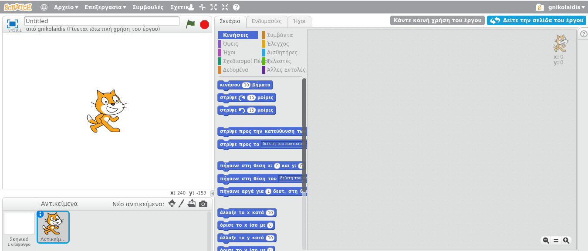
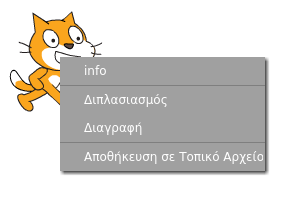

Μπορείς να χρησιμοποιήσεις το Scratch σε σύνδεση (online) ή εκτός σύνδεσης (offline).

+ Για να δημιουργήσεις ένα νέο έργο Scratch χρησιμοποιώντας τον online επεξεργαστή, πήγαινε στο <a href="http://jumpto.cc/scratch-new" target="_blank">jumpto.cc/scratch-new</a>.

+ Αν προτιμάς να εργάζεσαι εκτός σύνδεσης και δεν έχεις εγκαταστήσει ακόμα τον επεξεργαστή, μπορείς να το κατεβάσεις από το <a href="http://jumpto.cc/scratch-off" target="_blank">jumpto.cc/scratch-off</a>.
    
    Ο επεξεργαστής Scratch μοιάζει έτσι:
    
    

+ Η γάτα (αντικείμενο) που βλέπεις είναι η μασκότ του Scratch. Αν χρειάζεσαι ένα κενό έργο Scratch, μπορείς να διαγράψεις τη γάτα κάνοντας δεξί κλικ και μετά πατώντας **διαγραφή**.
    
    