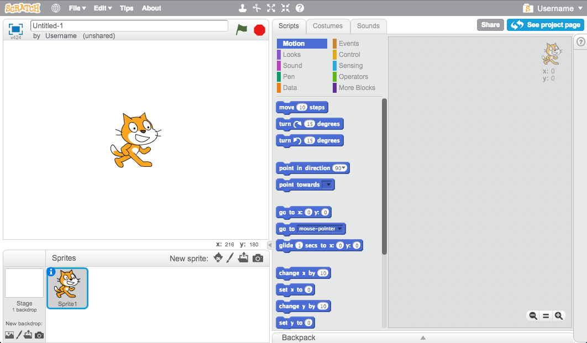

+ You can create a new Scratch project using the __online__ editor by going to <a href="http://jumpto.cc/scratch-new" target="_blank">jumpto.cc/scratch-new</a>. If you prefer to work __offline__, you can download and install the editor from <a href="http://jumpto.cc/scratch-off" target="_blank">jumpto.cc/scratch-off</a>.

	The Scratch editor looks like this:

	

+ The cat sprite that you can see is the Scratch mascot. If you don't need it, you can delete it by right-clicking and then clicking 'delete'.

	
