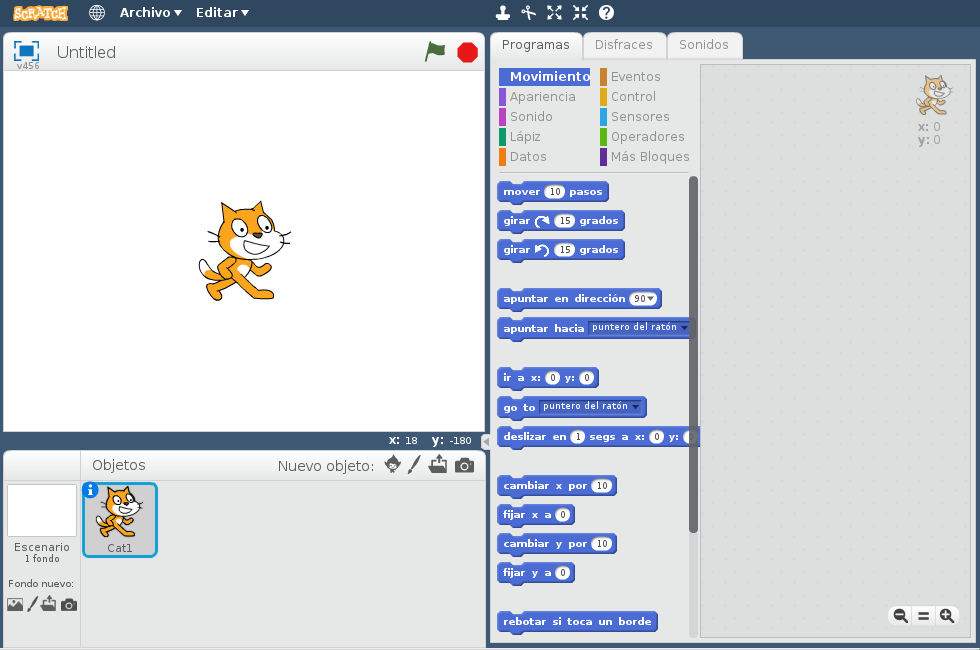
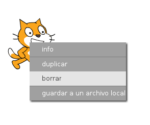

Puede usar Scratch en línea o sin conexión.

+ Para crear un nuevo proyecto en Scratch usando el editor en línea, dirígete a <a href="http://jumpto.cc/scratch-new" target="_blank">jumpto.cc/scratch-new</a>.

+ Si prefieres trabajar sin conexión y aún no has instalado el editor, puedes descargarlo desde <a href="http://jumpto.cc/scratch-off" target="_blank">jumpto.cc/scratch-off</a>.
    
    El editor de Scratch se ve así:
    
    

+ El objeto gato que ves es la mascota de Scratch. Si necesitas un proyecto de Scratch vacío, puedes eliminar el gato haciendo clic encima de él con el botón derecho y luego haciendo clic en **borrar**.
    
    