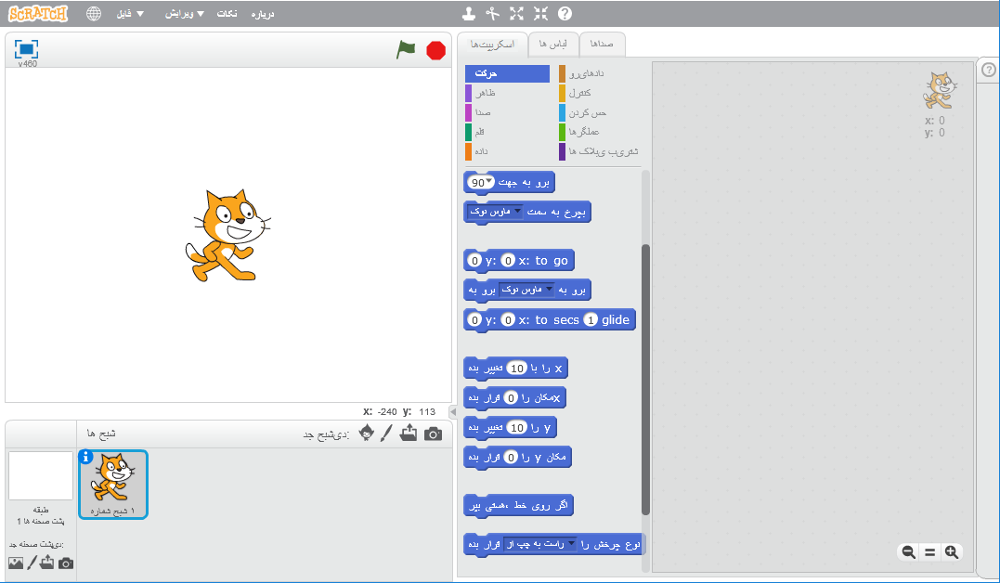
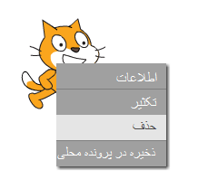

شما می توانید از اسکرچ به صورت آنلاین یا آفلاین استفاده کنید.

+ برای ایجاد یک پروژه‌ی جدید اسکرچ با استفاده از ویرایشگر آنلاین، به <a href="http://jumpto.cc/scratch-new" target="_blank">jumpto.cc/scratch-new</a> بروید.

+ اگر ترجیح می‌دهید آفلاین کار کنید و هنوز ویرایشگر را نصب نکرده‌اید، می‌توانید آن را از <a href="http://jumpto.cc/scratch-off" target="_blank">jumpto.cc/scratch-off</a> دانلود کنید.
    
    ویرایشگر اسکرچ مانند این است:
    
    

+ شبه گربه که آن را می‌بینید، نماد اسکرچ است. اگر شما نیاز به یک پروژه‌ی خالی اسکرچ دارید، می‌توانید با کلیک راست بر روی گربه و سپس کلیک روی **حذف**، آن را حذف کنید.
    
    