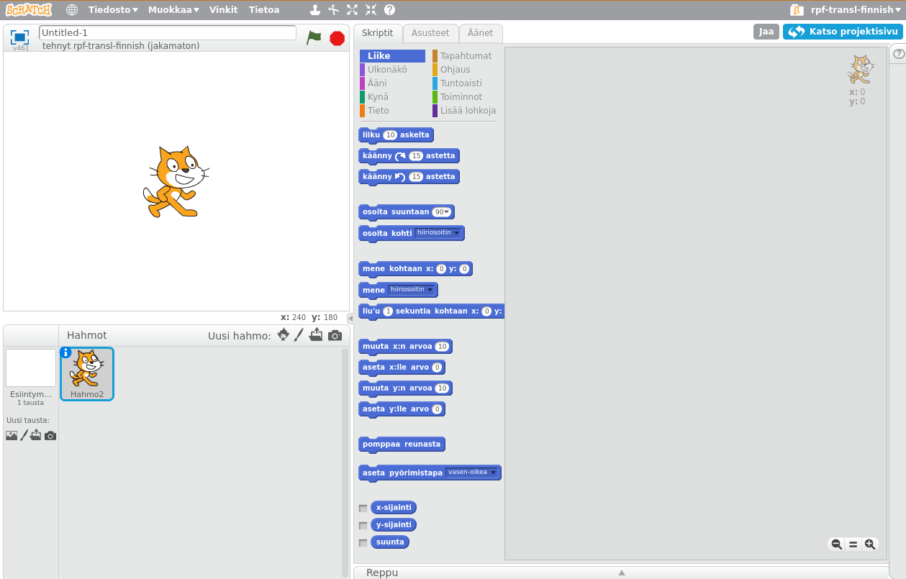
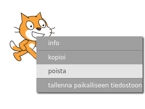

Voit käyttää Scratchia verkossa tai offline-tilassa.

+ Voit luoda uuden Scratch-projektin siirtymällä online-editoriin <a href="http://jumpto.cc/scratch-new" target="_blank">jumpto.cc/scratch-new</a>.

+ Jos haluat työskennellä offline-tilassa ja et ole vielä asentanut editoria, voit ladata sen osoitteesta <a href="http://jumpto.cc/scratch-off" target="_blank">jumpto.cc/scratch-off</a>.
    
    Scratch-editori näyttää tältä:
    
    

+ Kissa, jonka näet, on Scratch maskotti. Jos tarvitset tyhjän Scratch-projektin, voit poistaa kissan napsauttamalla sitä hiiren kakkospainikkeella ja valitsemalla **poista**.
    
    