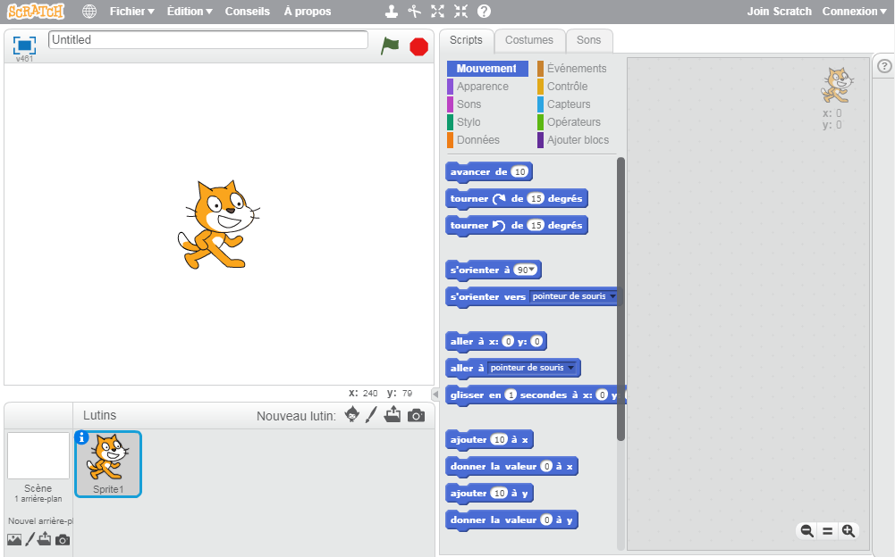
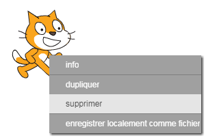

Tu peux utiliser Scratch en ligne ou hors ligne.

+ Pour créer un nouveau projet Scratch à l'aide de l'éditeur en ligne, va sur <a href="http://jumpto.cc/scratch-new" target="_blank">jumpto.cc/scratch-new</a>.

+ Si tu préfères travailler hors ligne et n'as pas encore installé l'éditeur, tu peux le télécharger depuis <a href="http://jumpto.cc/scratch-off" target="_blank">jumpto.cc/scratch-off</a>.
    
    L'éditeur Scratch ressemble à ceci:
    
    

+ Le chat que tu peux voir est la mascotte de Scratch. Si tu as besoin d'un projet Scratch vide, tu peux le supprimer en cliquant dessus avec le bouton droit de la souris, puis en cliquant sur **supprimer**.
    
    