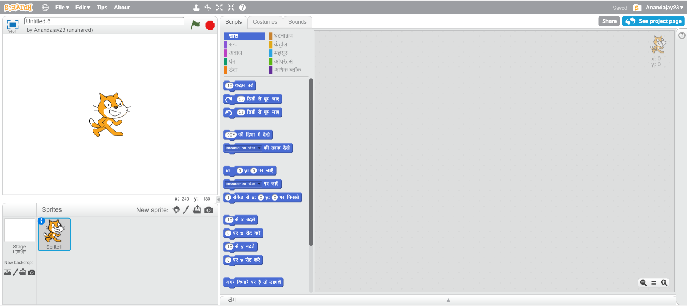
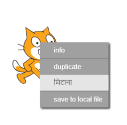

आप Scratch को ऑनलाइन या ऑफ़लाइन उपयोग कर सकते हैं।

+ ऑनलाइन एडिटर द्वारा नया Scratch प्रोजेक्ट बनाने के लिए, <a href="http://jumpto.cc/scratch-new" target="_blank">jumpto.cc/scratch-new</a> पर जाएँ।

+ यदि आप ऑफ़लाइन काम करना चाहें और अभी एडिटर को इनस्टॉल नहीं किया है, तो आप <a href="http://jumpto.cc/scratch-off" target="_blank">jumpto.cc/scratch-off</a> से इसे डाउनलोड कर सकते हैं।

	Scratch कुछ इस प्रकार दिखाई देता है:

	

+ आप जो cat स्प्राइट देख सकते हैं, वह Scratch मस्कट है। यदि आप खाली Scratch प्रोजेक्ट चाहते हैं, तो आप cat पर राइट क्लिक करके और फिर __delete__ पर क्लिक करके इसे मिटा सकते हैं।

	
