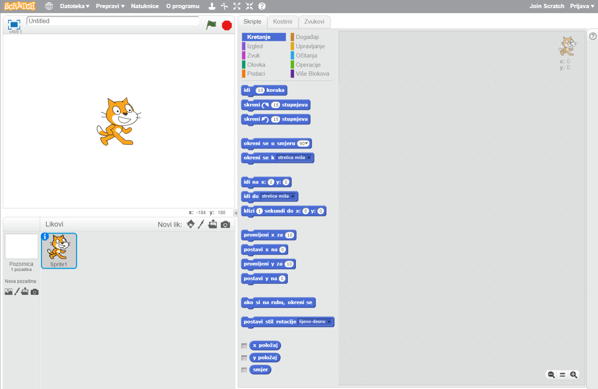
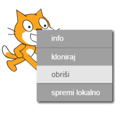

Možeš koristiti Scratch na Internetu ili bez Interneta.

+ Da bi stvorio novi Scratch projekt pomoću online Scratch aplikacije, idi na <a href="http://jumpto.cc/scratch-new" target="_blank">jumpto.cc/scratch-new</a>.

+ Ako želiš raditi bez Interneta i još nisi instalirao Scratch aplikaciju, možeš ju preuzeti sa stranice <a href="http://jumpto.cc/scratch-off" target="_blank">jumpto.cc/scratch-off</a>.
    
    Scratch aplikacija izgleda ovako:
    
    

+ Lik mačke koji možeš vidjeti je maskota Scratcha. Ako ti je potreban prazan Scratch projekt, možeš izbrisati mačku tako da klikneš na nju desnom tipkom miša i zatim odabereš **obriši**.
    
    