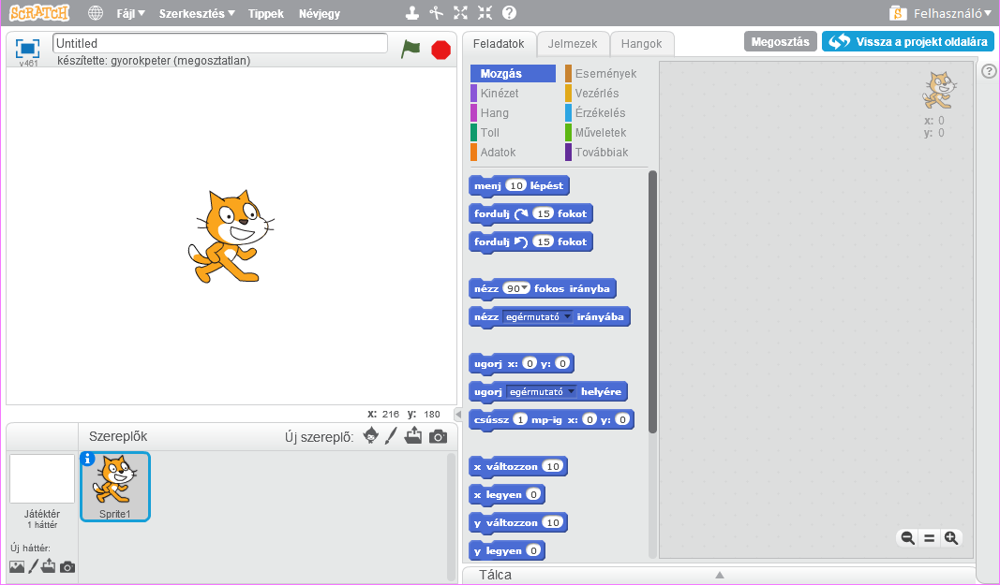
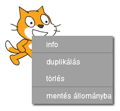

A Scratchet online vagy offline módban is használhatod.

+ Ha az online szerkesztőben szeretnél új Scratch projectet létrehozni, ugorj a <a href="http://jumpto.cc/scratch-new" target="_blank">jumpto.cc/scratch-new</a>címre.

+ Ha offline módban szeretne dolgozni, és még nem telepítette a szerkesztőt, akkor letöltheti a <a href="http://jumpto.cc/scratch-off" target="_blank">jumpto.cc/scratch-off</a>.
    
    A Scratch szerkesztő így néz ki:
    
    

+ Az a macska, amit láthatsz, a Scratch maskota. Ha szüksége van egy üres kaparóprojektre, akkor törölheti a macskát a jobb egérgombbal, majd kattintson a **törlés**gombra.
    
    