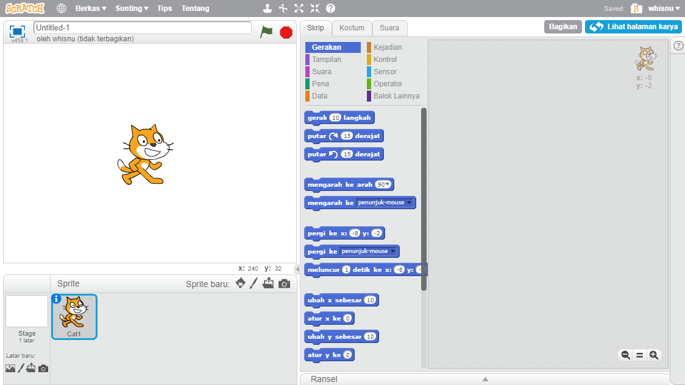
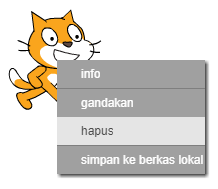

Kamu bisa menggunakan Scratch secara daring atau luring.

+ Untuk membuat sebuah proyek Scratch baru menggunakan editor daring, buka <a href="http://jumpto.cc/scratch-new" target="_blank">jumpto.cc/scratch-new</a>.

+ Jika Kamu memilih untuk bekerja secara luring dan belum menginstal editor, Kamu dapat mendownloadnya dari <a href="http://jumpto.cc/scratch-off" target="_blank">jumpto.cc/scratch-off</a>.
    
    Editor Scratch terlihat seperti ini:
    
    

+ Sprite kucing yang Kamu lihat adalah maskot Scratch. Jika Kamu memerlukan proyek Scratch kosong, Kamu dapat menghapus kucing dengan cara mengklik kanan kucing tersebut dan kemudian pilih **hapus**.
    
    