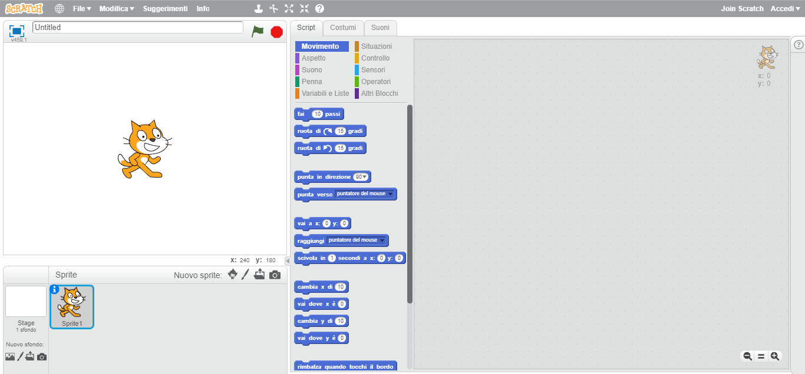
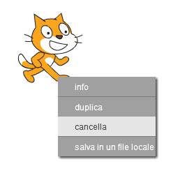

Puoi utilizzare Scratch online o offline.

+ Per creare un nuovo progetto di Scratch usando l'editor online, vai su <a href="http://jumpto.cc/scratch-new" target="_blank">jumpto.cc/scratch-new</a>.

+ Se preferisci lavorare offline e non hai ancora installato l'editor, puoi scaricarlo da <a href="http://jumpto.cc/scratch-off" target="_blank">jumpto.cc/scratch-off</a>.
    
    L'editor di Scratch ha questo aspetto:
    
    

+ Lo sprite del gatto che vedi è la mascotte di Scratch. Se hai bisogno di un progetto di Scratch vuoto, puoi eliminare il gatto facendo click con il pulsante destro del mouse sullo sprite, e scegliendo **cancella**.
    
    