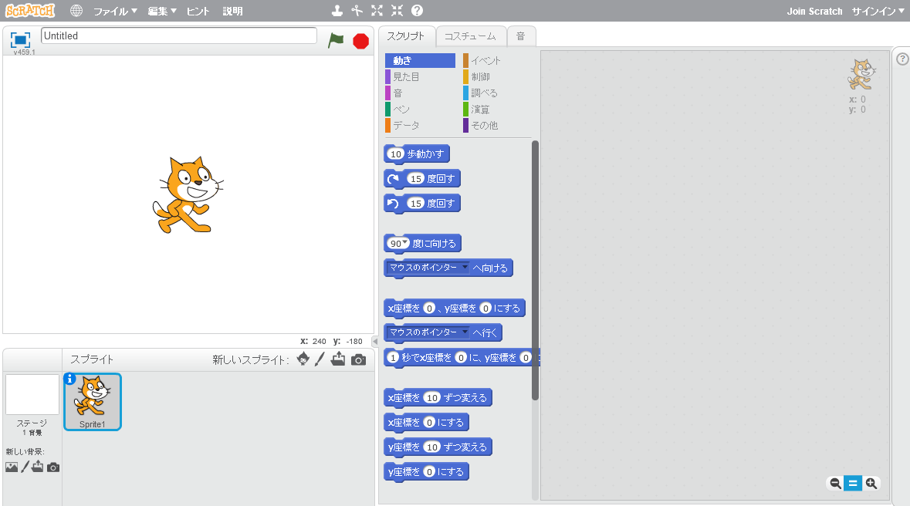
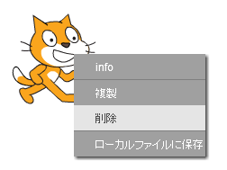

スクラッチはオンラインまたはオフラインで使用できます。

+ オンラインエディターを使用して新しいスクラッチのプロジェクトを作成するには、 <a href="http://jumpto.cc/scratch-new" target="_blank">jumpto.cc/scratch-new</a> を訪ねてください。

+ オフラインで作業し、エディターをまだインストールしていない場合は、 <a href="http://jumpto.cc/scratch-off" target="_blank">jumpto.cc/scratchoff</a> からダウンロードできます。
    
    スクラッチのエディターは次のようになります。
    
    

+ 目の前に見える猫のスプライトはスクラッチのマスコットです。空のスクラッチプロジェクトが必要な場合は、右クリックしてから **削除** をクリックして、その猫を削除できます。
    
    