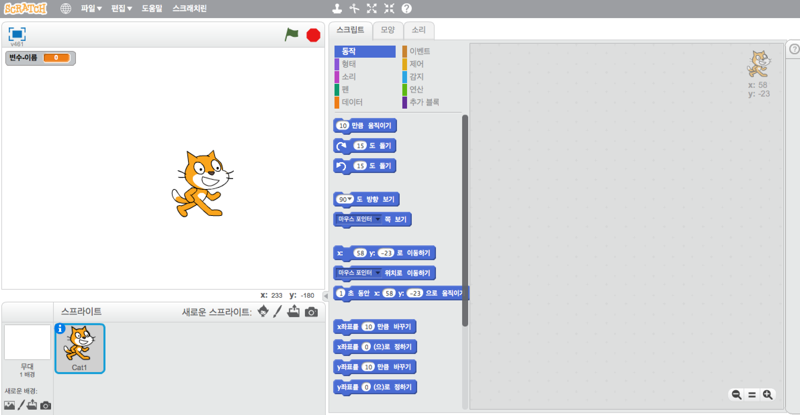
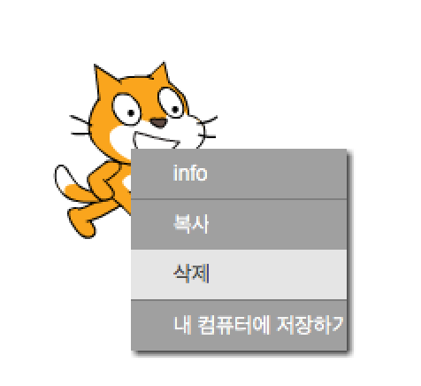

온라인 또는 오프라인으로 스크래치를 사용할 수 있습니다.

+ 온라인 편집기를 사용하여 새 스크래치 프로젝트를 작성하려면 <a href="http://jumpto.cc/scratch-new" target="_blank">jumpto.cc/scratch-new</a>로 이동하십시오.

+ 편집기를 아직 설치하지 않았고 오프라인으로 작업하고 싶은 경우, <a href="http://jumpto.cc/scratch-off" target="_blank">jumpto.cc/scratch-off</a>에서 다운로드 할 수 있습니다.
    
    스크래치 편집기는 다음과 같습니다.
    
    

+ 고양이 스프라이트는 스크래치의 마스코트입니다. 빈 Scratch 프로젝트가 필요하면 마우스 오른쪽 버튼을 클릭 한 다음 **삭제**를 클릭하여 고양이를 삭제할 수 있습니다.
    
    