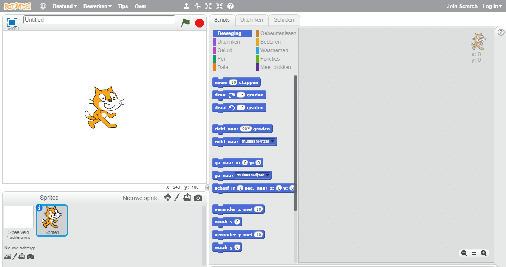
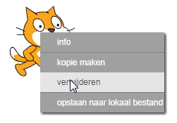

Je kunt Scratch online of offline gebruiken.

+ Ga naar <a href="http://jumpto.cc/scratch-new" target="_blank">jumpto.cc/scratch-new</a> om een ​​nieuw Scratch-project te starten met behulp van de online editor.

+ Als je liever offline werkt en de editor nog niet hebt geïnstalleerd, kunt je deze downloaden via <a href="http://jumpto.cc/scratch-off" target="_blank">jumpto.cc/scratchoff</a>.
    
    De Scratch-editor ziet er als volgt uit:
    
    

+ De kat sprite die je ziet, is de Scratch-mascotte. Als je een leeg Scratch-project nodig hebt, kun je de kat verwijderen door er met de rechtermuisknop op te klikken en vervolgens te klikken op **verwijderen**.
    
    