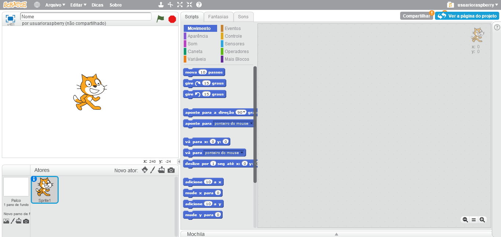
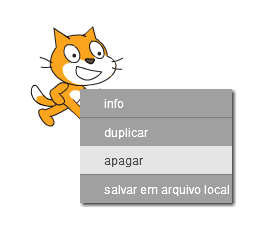

Você pode usar o Scratch online ou offline.

+ Para criar um novo projeto Scratch usando o editor online, acesse <a href="http://jumpto.cc/scratch-new" target="_blank">jumpto.cc/scratch-new</a>.

+ Se você preferir trabalhar offline e ainda não instalou o editor, você pode baixá-lo em <a href="http://jumpto.cc/scratch-off" target="_blank">jumpto.cc/scratch-off</a>.
    
    O editor Scratch se parece com isso:
    
    

+ O ator de gato que você pode ver é o mascote Scratch. Se você precisa de um projeto Scratch vazio, você pode excluir o gato clicando com o botão direito e clicando em **apagar**.
    
    