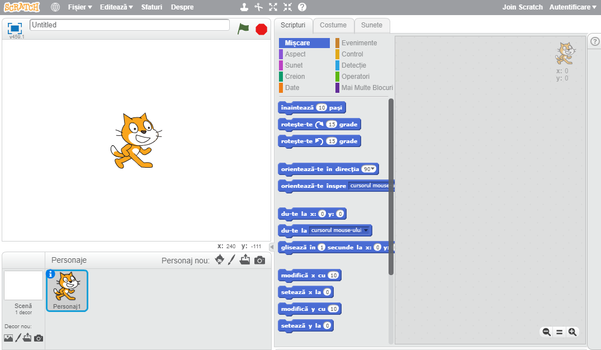
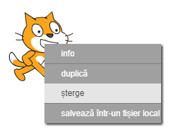

Puteți utiliza Scratch online sau offline.

+ Pentru a crea un nou proiect Scratch folosind editorul online, mergeți la <a href="http://jumpto.cc/scratch-new" target="_blank">jumpto.cc/scratch-new</a>.

+ Dacă preferați să lucrați offline și nu ați instalat încă editorul, îl puteți descărca de la <a href="http://jumpto.cc/scratch-off" target="_blank">jumpto.cc/scratch-off</a>.
    
    Editorul Scratch arată astfel:
    
    

+ Personajul pisică pe care îl puteți vedea este mascota Scratch. Dacă aveți nevoie de un proiect Scratch gol, puteți șterge pisica făcând clic dreapta pe ea, apoi făcând clic pe **șterge**.
    
    