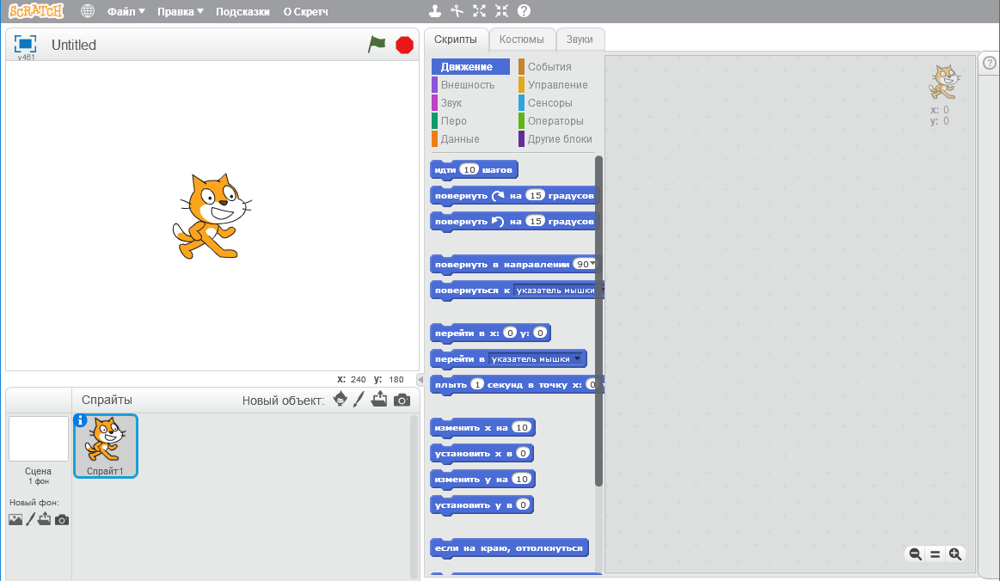
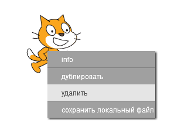

Ты можешь использовать Скретч онлайн (на сайте) и офлайн (без необходимости подключаться к Интернету).

+ Чтобы создать новый проект Скретч с помощью онлайн-редактора, перейди по следующей ссылке <a href="http://jumpto.cc/scratch-new" target="_blank">jumpto.cc/scratch-new</a>.

+ Если тебе больше нравится работать без подключения к Интернету, но у тебя ещё не установлен редактор, то ты можешь загрузить его по этой ссылке: <a href="http://jumpto.cc/scratch-off" target="_blank">jumpto.cc/scratch-off</a>.
    
    Редактор Скретч выглядит так:
    
    

+ Спрайт с изображением кота, который ты видишь, - это талисман Скретч. Если тебе нужен пустой проект Скретч, то ты можете убрать кота, щeлкнув по изображению правой кнопкой мыши, а затем выбирая пункт меню **удалить**.
    
    