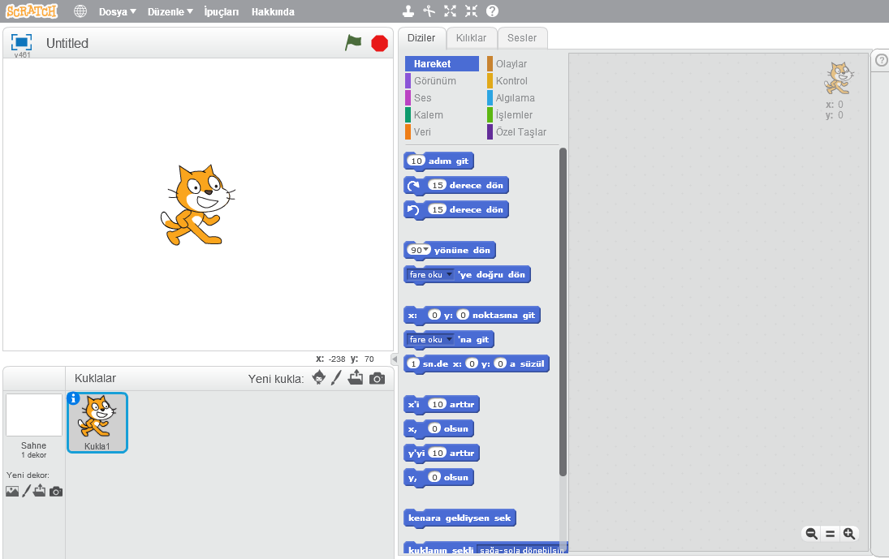
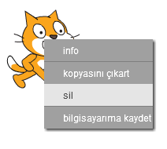

Scratch'ı çevrimiçi veya çevrimdışı olarak kullanabilirsiniz.

+ Çevrimiçi düzenleyiciyi kullanarak yeni bir Scratch projesi oluşturmak için <a href="http://jumpto.cc/scratch-new" target="_blank">jumpto.cc/scratch-new</a> adresine gidin.

+ Çevrimdışı çalışmayı tercih ediyorsanız ve henüz editörü kurmadıysanız <a href="http://jumpto.cc/scratch-off" target="_blank">jumpto.cc/scratch-off</a> adresinden indirebilirsiniz.
    
    Scratch editörü şu şekilde görünür:
    
    

+ Gördüğünüz kedi kuklası, Scratch'in maskotudur. Boş bir Scratch projesine ihtiyacınız varsa, üzerine önce sağ tıklayıp sonra **sil**'e tıklayarak kediyi silebilirsiniz.
    
    