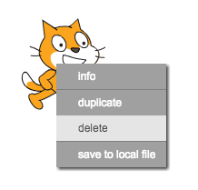

Bạn có thể sử dụng Scratch trực tuyến hoặc ngoại tuyến.

+ Để tạo dự án Scratch mới bằng trình chỉnh sửa trực tuyến, hãy truy cập <a href="http://jumpto.cc/scratch-new" target="_blank">jumpto.cc/scratch-new</a>.

+ Nếu bạn thích làm việc ngoại tuyến và chưa cài đặt trình soạn thảo, bạn có thể tải xuống từ <a href="http://jumpto.cc/scratch-off" target="_blank">jumpto.cc/scratch-off</a>.
    
    Trình soạn thảo Scratch trông giống như sau:
    
    

+ Hình ảnh con mèo mà bạn có thể thấy là linh vật Scratch. Nếu bạn cần một dự án Scratch trống, bạn có thể xóa con mèo bằng cách nhấp chuột phải vào nó và sau đó nhấp vào **xóa**.
    
    