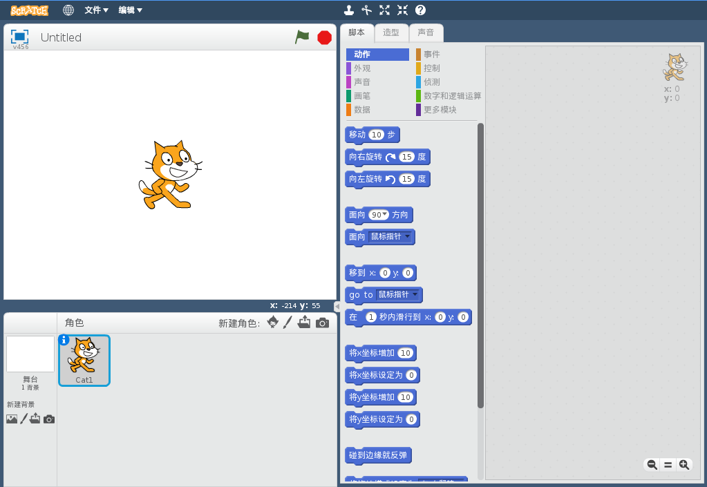
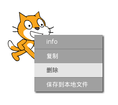

你可以在线或离线使用 Scratch。

+ 要使用在线编辑器创建一个新的 Scratch 项目，请前往 <a href="http://jumpto.cc/scratch-new" target="_blank">jumpto.cc/scratch-new</a>。

+ 如果你更喜欢离线工作，且目前还未安装编辑器，可以从 <a href="http://jumpto.cc/scratch-off" target="_blank">jumpto.cc/scratch-off</a> 进行下载。

	Scratch 编辑器如下所示：

	

+ 你能看到的猫咪子图为 Scratch 的吉祥物。如果你需要一个空白的 Scratch 项目，你可以通过右键单击后点击__删除__来删除猫咪。

	
